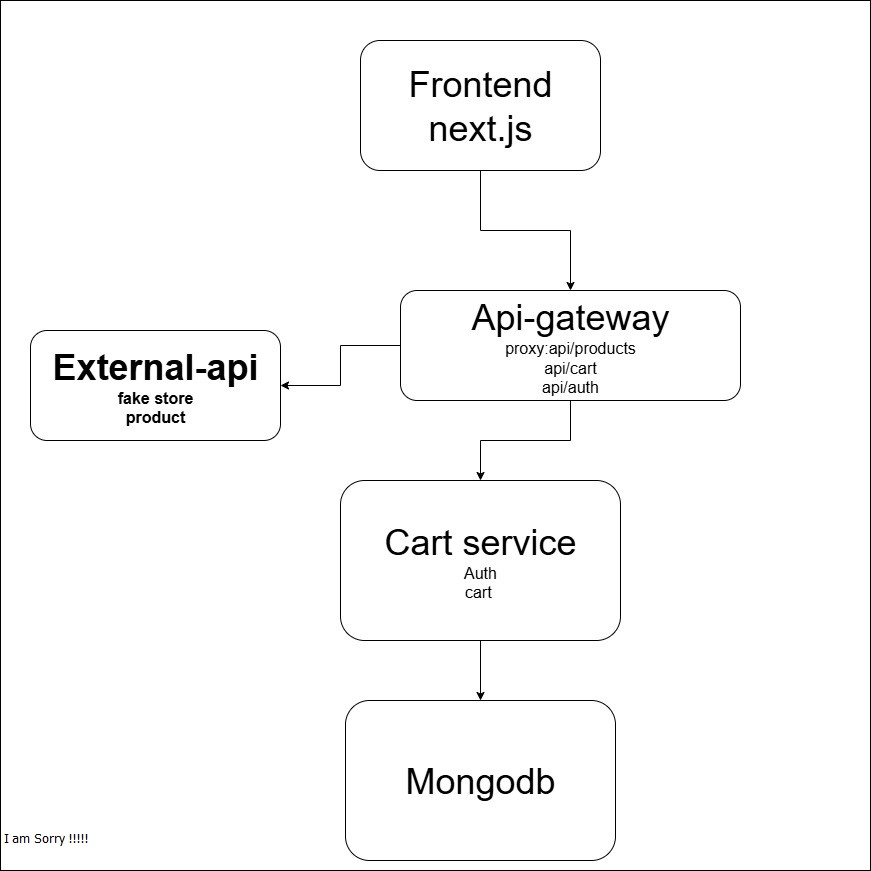

# 🛒 E-commerce Checkout System (Microservices POC)

This repository contains the **Cart + Auth Service** implementation for the E-commerce Checkout System Challenge.  
It demonstrates how to break down a monolithic checkout process into microservices, focusing on authentication, cart management, and integration with a product catalog (via an external FakeStore API).

---

## 1. Architectural Proposal (Microservices View)

### Services (High Level)

#### **API Gateway / BFF**

- **Purpose**: Single entry point for the frontend. Handles routing, rate-limiting, security headers, and proxies requests to services and third-party APIs.
- **Responsibilities**:
  - Proxy requests to Cart Service (`/api/cart`, `/api/auth`).
  - Proxy product data from FakeStore API (`/api/products`).
- **Data**: No persistent data; only configuration and runtime logs.

#### **Auth Service (implemented inside Cart Service)**

- **Purpose**: Handle user registration, login, JWT issuance, and user profiles.
- **Data**: User records (username, email, hashed password, role, timestamps).

#### **Cart Service (this repo)**

- **Purpose**: Manage users’ carts. (POC includes `add-to-cart` and `get-cart` endpoints).
- **Data**: Cart items (`userId`, `productId`, `title`, `category`, `description`, `price`, `image`, `quantity`).

#### **Product Catalog**

- **Purpose**: Canonical product data (pricing, images, stock).
- **POC**: Uses [FakeStore API](https://fakestoreapi.com) proxied through the gateway.

#### **Order / Payment Service (Future Work)**

- **Purpose**: Checkout flow, payment capture, order creation, stock reservation.

### Why This Split?

- ✅ **Separation of concerns** → Auth, cart, payments, and catalog evolve independently.
- ✅ **Independent scaling** → Cart vs payment have different load patterns.
- ✅ **Frontend simplicity** → Gateway acts as a BFF (Backend-for-Frontend).

---

## 2. Architecture Diagram



---

## 3. How to Run Locally (Backend)

### Prerequisites

- Node.js 18+ (or recent LTS)
- npm
- MongoDB (local or Atlas)

### Cart Service Setup

```bash
# Clone the repo
git clone https://github.com/Favourof/bankend-microservice-ecormmrce.git
cd cart-service

# Install dependencies
npm install

# Create .env file
PORT=4001
MONGO_URI=mongodb://127.0.0.1:27017/cart-service
JWT_SECRET=yudrdvy6ygfe468378rt3rwdvscfdt3fcedriscudsjdcsatdcfjsvdsjfjvcjcvoqwjdncdihdgcvgdhewdfjewdgvewdfsdvsfcwtyefcdew

# Run the service
npm run dev
```

### API Gateway Setup

cd api-gateway
npm install

# .env file

PORT=4000
CART_SERVICE_URL=http://localhost:4001
FAKESTORE_API_URL=https://fakestoreapi.com
FRONTEND_URL=http://localhost:3000

# Run

npm run dev

## API Endpoints

#Auth

| Method | Endpoint                       | Description                         |
| ------ | ------------------------------ | ----------------------------------- |
| `POST` | `/api/auth/register`           | Register a new user                 |
| `POST` | `/api/auth/login`              | Login and get JWT token             |
| `GET`  | `/api/auth/onAuthStateChanged` | Get logged-in user (requires token) |

## Frontend (Next.js)

# Clone frontend repo

git clone https://github.com/Favourof/frontend-microservice-ecormmrce.git
cd ecommerce-frontend

# Install deps

npm install

# .env.local

NEXT_PUBLIC_API_URL=http://localhost:4000

# Run frontend

npm run dev

## Flow

/products → fetch product list from /api/products (proxied to FakeStore API).

"Add to Cart" → calls /api/cart/add-to-cart (requires login).

/cart → protected route, fetches cart items via /api/cart/get-cart/:userId.
