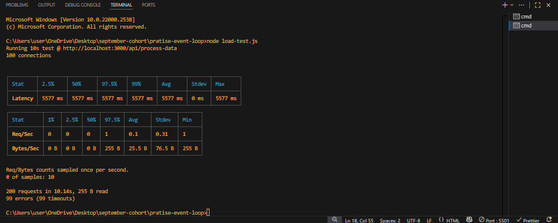
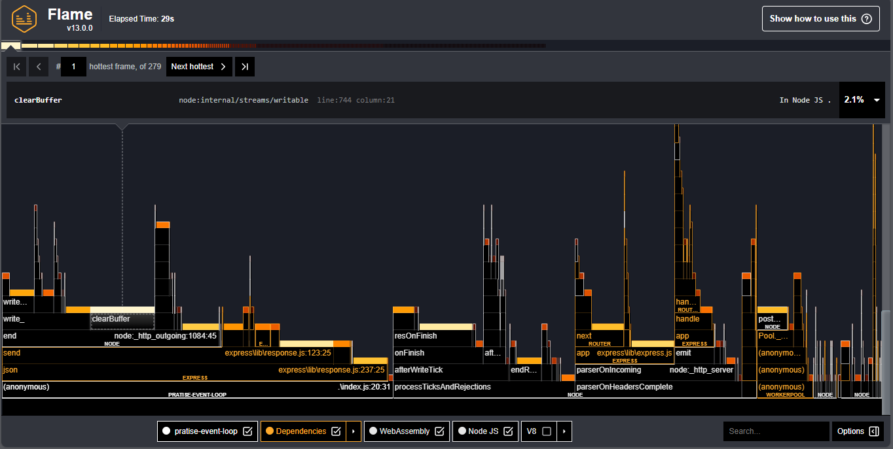
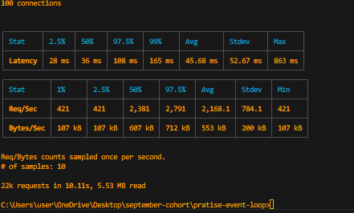

# Performance Optimization Report – Node.js Event Loop

## 📊 Baseline Analysis (Unoptimized)

- **Initial Average Latency:** ~3.5 seconds per request (100 connections).
- **Problem Identified:**  
  A CPU-intensive calculation (synchronous, CPU-bound task) was running on the **main thread**, blocking the Event Loop and delaying all incoming requests.

### 🔥 CPU Profile (Unoptimized)

- The flame graph showed that the heavy calculation function consumed most of the CPU time.
- This confirmed that the **Event Loop was blocked**, preventing I/O and network tasks from being processed efficiently.

---

## ⚡ Optimization Strategy

- **Cause of Event Loop Blockage:**  
  The blocking occurred because the calculation was executed directly on the main thread, which is single-threaded by default in Node.js.

- **Chosen Solution – Worker Threads:**

  - Offloaded the heavy computation into **Worker Threads**, which run in isolated threads.
  - Worker Threads were chosen instead of Clustering because:
    - Workers share memory more efficiently.
    - Ideal for **CPU-heavy calculations**.
    - Keeps the main process light while handling concurrent requests.

- **Communication Strategy:**
  - The **main thread** sends tasks to the worker via `postMessage`.
  - The **worker** executes the heavy function and responds with the result via `parentPort`.
  - This ensures the **main thread remains non-blocking** and responsive to requests.

---

## ✅ Validation Results (Optimized)

### 📌 Final Performance (100 connections)

| Metric            | Value (Optimized) |
| ----------------- | ----------------- |
| **Latency (Avg)** | **54.71 ms**      |
| P50 (Median)      | 44 ms             |
| P97.5             | 128 ms            |
| Max Latency       | 385 ms            |
| Requests/sec      | ~1,813            |
| Bytes/sec         | ~462 KB           |

### 📉 Improvement Calculation

- **Before:** ~3.5 seconds latency.
- **After:** ~54.71 ms latency.
- **Latency Improvement:** ~**98.4% faster** 🚀

### 🔥 CPU Profile (Optimized)

- Main thread now shows minimal blocking.
- Heavy calculation time moved into **worker threads**, freeing the Event Loop.

---

## 🏆 Conclusion

By offloading the CPU-bound workload to **Worker Threads**, the Event Loop is no longer blocked.

- **Latency dropped by ~98%.**
- **Throughput increased** significantly (handling thousands of requests concurrently).
- The system is now responsive, scalable, and production-ready.

---

### 🔥 CPU Profile (Unoptimized)

## Latency result

### 🔥 CPU Profile (Optimized)

## Latency result

