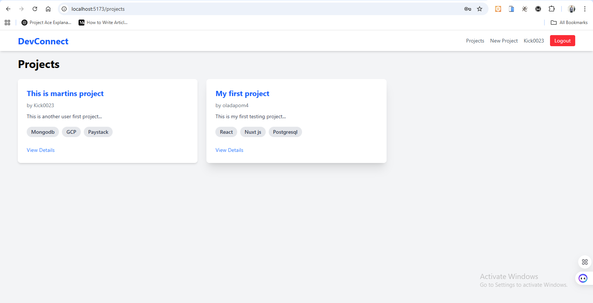
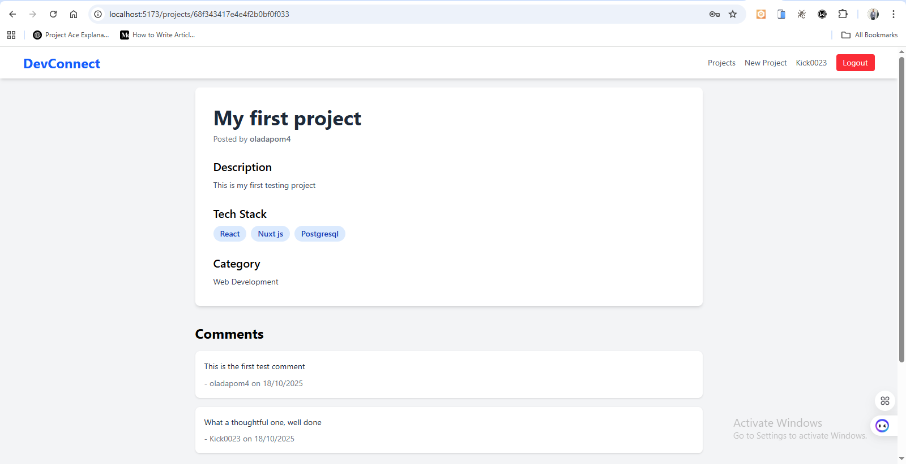
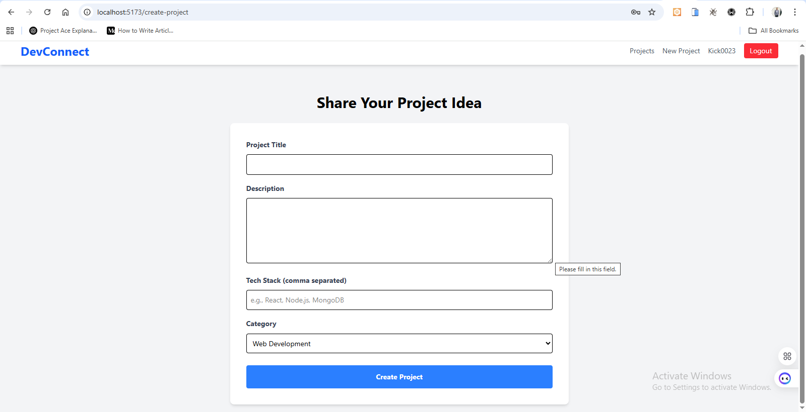
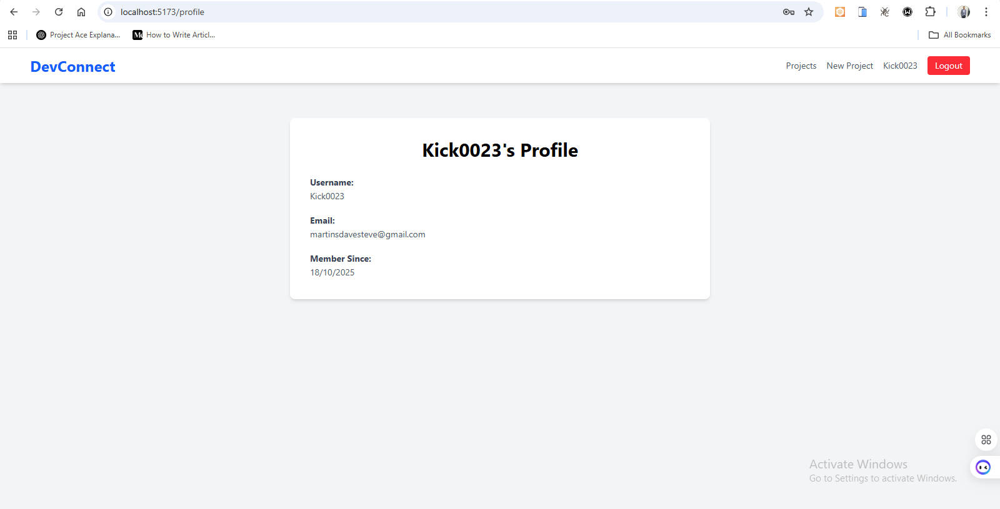

---

# 2. Frontend README (`devconnect-frontend/README.md`)

```markdown
# DevConnect - Frontend 🖥️

This repository contains the frontend client for **DevConnect**, a lightweight developer collaboration platform. It is a modern, fast, and responsive single-page application built with React (using Vite) and styled with Tailwind CSS.

## Live Demo

* **Live URL:** `https://your-frontend-deployment-url.vercel.app` (Replace with your deployed URL)

## Features

* **User Authentication:** Full signup and login flow with JWT.
* **Project Browsing:** View a list of all project ideas posted by users.
* **Project Details:** Click on any project to see its full description, tech stack, and comments.
* **Create Projects:** Authenticated users can post new project ideas via a simple form.
* **Commenting:** Logged-in users can post comments on project detail pages.
* **User Profiles:** A dedicated page to show the logged-in user's profile information.

## Tech Stack

* **Framework/Library:** React
* **Build Tool:** Vite
* **Styling:** Tailwind CSS
* **Routing:** React Router DOM
* **HTTP Client:** Axios
* **State Management:** React Context API

---

## Setup and Installation

### Prerequisites

* [Bun](https://bun.sh/)
* [Node.js](https://nodejs.org/) (v18+)

### 1. Clone the repository

```bash
git clone https://github.com/martins0023/devconnect-frontend
cd devconnect-frontend
````

### 2\. Install dependencies

```bash
bun install
```

### 3\. Set up environment variables

Create a `.env` file in the root of the project and add the URL of your running backend API:

```env
# The URL of your deployed or local backend API
VITE_API_URL=http://localhost:5000/api
```

### 4\. Run the application

```bash
bun dev
```

The application will be available at `http://localhost:5173`.

-----

## Screenshots

### Project Listing Page



### Project Detail Page (with Comments)



### Create New Project



### User Profile Page



```
```