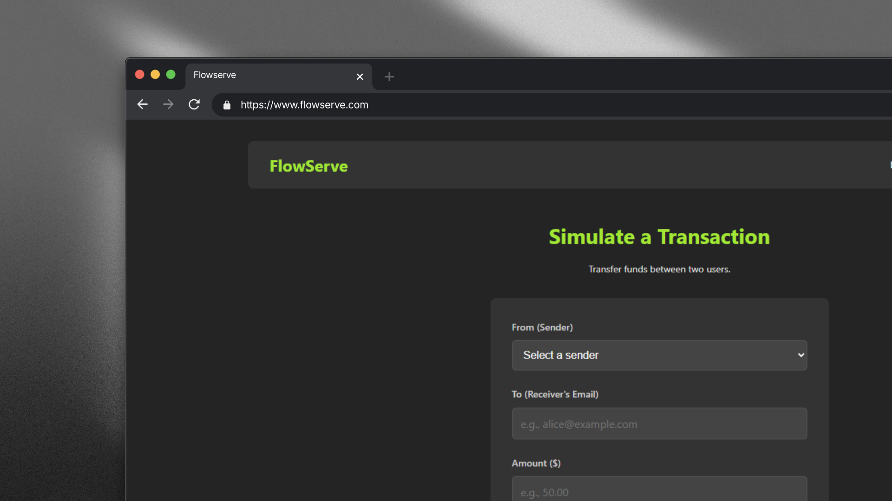
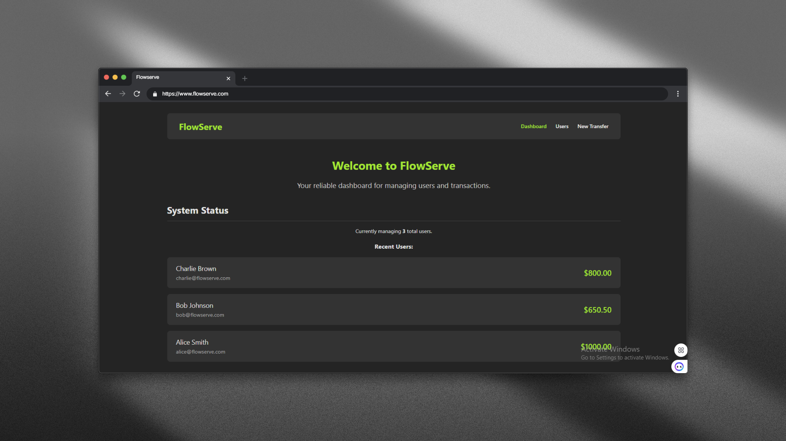
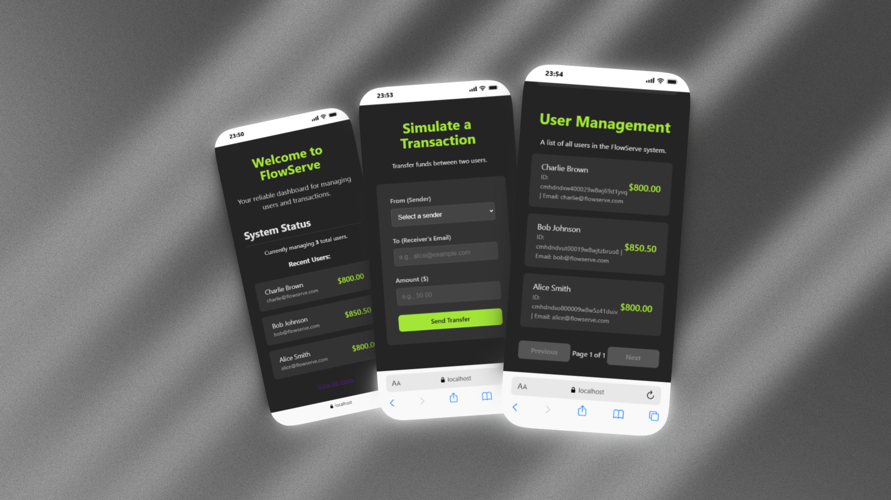
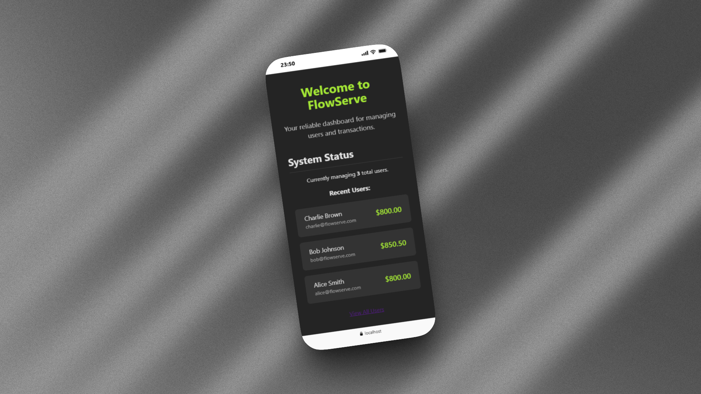
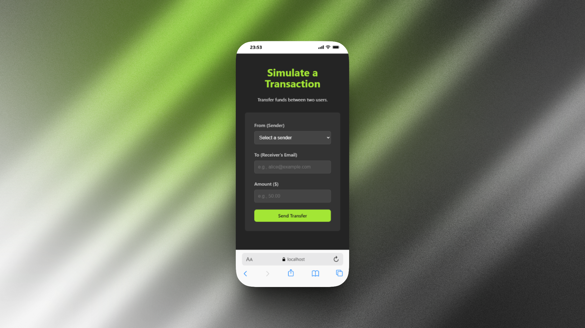

# FlowServe Frontend 🚀 [Deployed site](https://flowserve-frontend.vercel.app/)

This repository contains the frontend client for the **Software Engineering Week 6 Challenge**. It's a lightweight React (Vite) application built to simulate user management and real-time transaction processing for the FlowServe Fintech API.

This project consumes the API built in the backend repository.

**➡️ Backend Repository Link:** `[flowserve-backend](https://github.com/martins0023/flowserve-backend)` 

-----

## Features

  * **Dashboard:** A simple overview page to welcome the user.
  * **User Management:** Fetches and displays a paginated list of all users and their current wallet balances from the API.
  * **Transaction Simulation:** A dedicated form to simulate a fund transfer between two users (one as sender, one as receiver via email).
  * **State Management:** Gracefully handles all **loading**, **error**, and **success** states for API calls using TanStack Query.
  * **Real-time Feedback:** Provides instant, real-time toast notifications for successful transfers or API errors using `react-hot-toast`.

-----

## 💻 Tech Stack

  * **Core:** React 18 + Vite
  * **Data Fetching & State:** TanStack Query (React Query) v5
  * **API Client:** Axios
  * **Routing:** React Router v6
  * **Notifications:** React Hot Toast
  * **Styling:** Plain CSS 3 (via `index.css`)

-----

## 🔧 Setup and Installation

Follow these steps to get the project running on your local machine.

### 1\. Clone the Repository

```bash
git clone https://github.com/martins0023/flowserve-frontend.git
cd flowserve-frontend
```

### 2\. Install Dependencies

This project uses `npm` as its package manager.

```bash
npm install
```

### 3\. Set Up Environment Variables

This project requires a single environment variable to know where to find the backend API.

1.  Create a new file in the root of the project named `.env`
2.  Copy and paste the following line into it:


```env
VITE_API_BASE_URL=http://localhost:8000/api/v1
```

*(This URL assumes your `flowserve-backend` is running locally on port 8000. If you deployed your backend, replace this with your live Render/Railway URL.)*

-----

## ▶️ Running the Application

1.  **Start the Backend First\!**
    Ensure your `flowserve-backend` server is running in a separate terminal.

    ```bash
    # In your /flowserve-backend folder
    npm run dev
    ```

2.  **Start the Frontend**
    Once the backend is running, start the frontend development server.

    ```bash
    npm run dev
    ```

3.  **Open the App**
    Open your browser and navigate to `http://localhost:5173` (or the port specified in your terminal).

-----

## 📁 Project Structure

The project is structured to be scalable and maintainable, separating concerns by feature.

```
flowserve-frontend/
├── src/
│   ├── api/                # Axios instance and API functions (users.api.js, etc.)
│   ├── components/         # Reusable UI components (Layout.jsx, Navbar.jsx, etc.)
│   ├── hooks/              # Custom TanStack Query hooks (useUsers.js, useTransactions.js)
│   ├── pages/              # Main page components (Dashboard.jsx, UsersPage.jsx, etc.)
│   ├── App.jsx             # Main application component with React Router routes
│   ├── index.css           # Global stylesheet
│   └── main.jsx            # App entry point, QueryClientProvider setup
├── .env                  # Local environment variables
├── index.html            # Main HTML template
├── package.json          # Project dependencies and scripts
└── README.md             # You are here!
```

## Project UI Interface

[Deployed site](https://flowserve-frontend.vercel.app/)

### Desktop
1.  

2.  

3.  


### Mobile
1.  

2.  

3.  