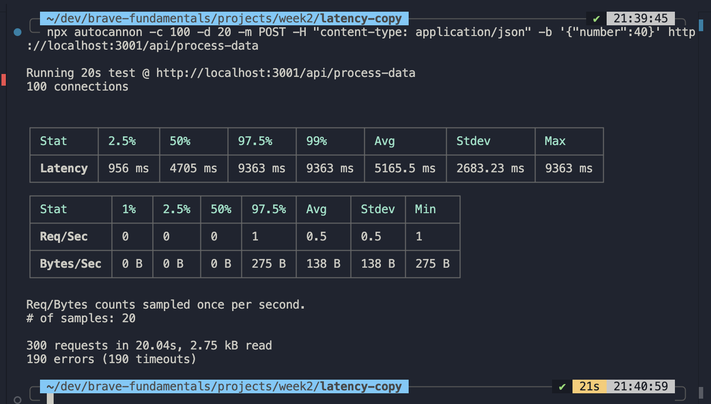
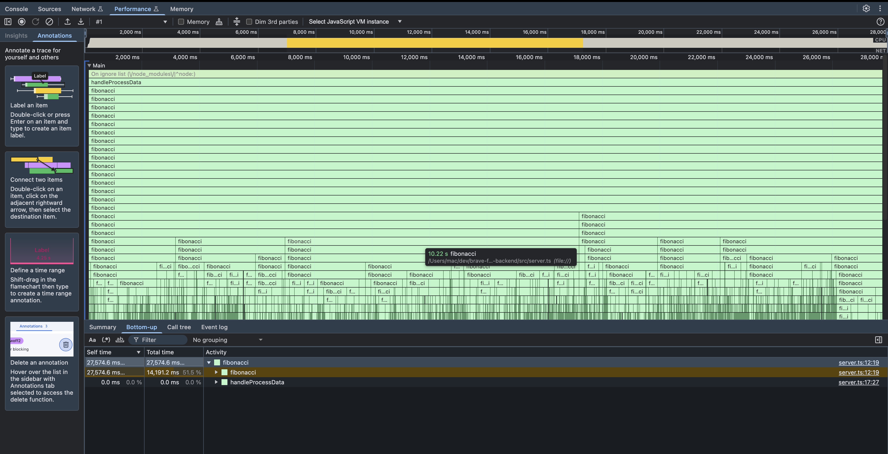
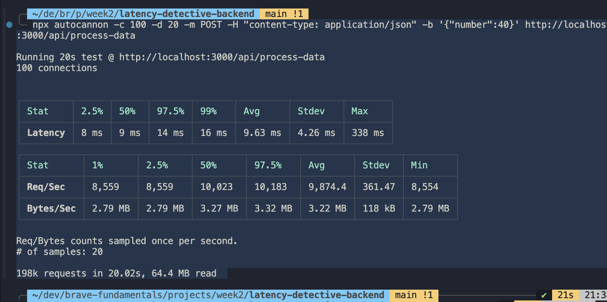

# Latency Detective – Performance Profiling Report

## Challenge Overview

This project shows how to profile and optimize a Node.js/Express backend when it's handling lots of requests at once. It shows how CPU-intensive tasks can block down the Event Loop, then fix the problem using Worker Threads.

---

## Phase 1: Baseline Analysis (Unoptimized)

Test Command

```bash
npx autocannon -c 100 -d 20 -m POST -H "content-type: application/json" -b '{"number":40}' http://localhost:3001/api/process-data
```



### CPU Profile & Flame Graph Observations:

- The main thread was heavily blocked during the Fibonacci calculation.
- The synchronous loop consumed most of the CPU time.
- I/O operations were significantly delayed or failed due to Event Loop blockage.



### Interpretation:

The unoptimized endpoint is CPU-bound, causing extremely high latency (~5 seconds per request on average) and many failed/timeout requests (190/300). The server cannot handle 100 concurrent connections efficiently.

---

## Phase 2: Optimization with Worker Threads

### Strategy

I offloaded the CPU-intensive Fibonacci calculation to Worker Threads and used a persistent mapping mechanism within the worker pool to track previously computed values, improving performance under high load.

The main Express thread now only delegates tasks and awaits results asynchronously.

This allows the server to remain responsive to I/O while the CPU-bound task runs in background threads.

Test Command

```bash
npx autocannon -c 100 -d 20 -m POST -H "content-type: application/json" -b '{"number":40}' http://localhost:3000/api/process-data
```



### CPU Profile Observations:

- The main thread remains mostly free.

- Worker threads handle CPU-intensive tasks.

- The server can handle high concurrency without request failures.

### Interpretation:

Optimization with Worker Threads reduced average latency by 99.8% (from 5165 ms to 9.63 ms) and eliminated failed requests entirely. The throughput increased dramatically (from ~15 requests/sec to ~9,874 requests/sec).

---

## Phase 3: Comparative Summary

| Metric               | Unoptimized | Optimized   | Improvement |
| -------------------- | ----------- | ----------- | ----------- |
| Avg Latency          | 5165.5 ms   | 9.63 ms     | 99.8% ↓     |
| Max Latency          | 9363 ms     | 338 ms      | 96.4% ↓     |
| Success Rate         | 36.7%       | 100%        | +63.3%      |
| Throughput (Req/sec) | 0.5 avg     | 9,874.4 avg | +19748x     |
| Failed Requests      | 190         | 0           | 100% ↓      |

### Interpretation:

- Offloading CPU-intensive operations to Worker Threads allows Node.js to remain non-blocking for I/O.

- The Event Loop is no longer blocked, ensuring the server can respond rapidly to all incoming requests.

- High-concurrency scenarios now execute reliably without timeouts.

## Conclusion

- The initial implementation demonstrated classic Event Loop blockage in Node.js for synchronous CPU-heavy tasks.

- Worker Threads provide an effective method to offload CPU-intensive computations, restoring high throughput and low latency.

- This approach is suitable for performance-critical applications where heavy calculations are unavoidable.

## Running the Backend Server

1. Clone the repository and install dependencies:

```bash
git clone https://github.com/NueloSE/latency-detective-backend
cd latency-detective-backend
npm install
```

2. Start the server :

There are two ways to run and interact with the backend server:

- **Option 1:** Direct API requests
  You can send requests directly to the endpoint: `http://localhost:3000/api/process-data`
  Make sure the server is running before sending requests:

```bash
npm run dev
```

- **Option 2:** Using the Frontend app
  If you want to trigger benchmarks from the frontend, ensure both servers are running:

```bash
npm run dev                   # Starts the main server (server.ts)
npx ts-node src/benchmark.ts  # Starts the benchmark server
```

3. Server URLs:

- Main API server: `http://localhost:3000`

- Benchmark endpoint: `POST http://localhost:3002/api/benchmark`

4. Example JSON request body for the benchmark endpoint:

```json
{
  "fibNum": 40,
  "connections": 100,
  "duration": 20
}
```
